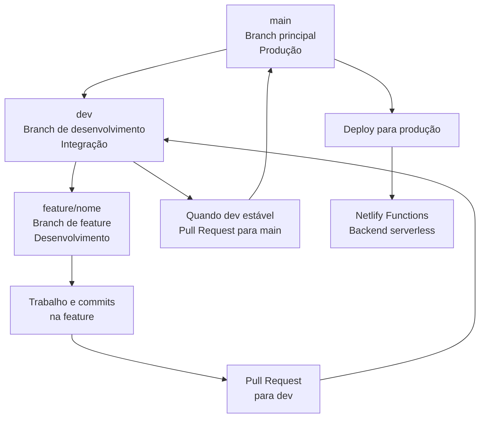

# SkyFlow Airline

Uma aplicação moderna de reserva de voos construída com Angular e arquitetura de Micro Frontends (MFE), focada em performance, escalabilidade e experiência do usuário excepcional.

## 🚀 Funcionalidades

- **Reserva de Voos**: Interface intuitiva para buscar e reservar voos.
- **Dashboard do Usuário**: Gerencie suas reservas e informações pessoais.
- **Check-in Online**: Processo simplificado de check-in.
- **Micro Frontends**: Arquitetura modular para fácil manutenção e escalabilidade.
- **Server-Side Rendering (SSR)**: Otimização para SEO e performance.
- **Backend Serverless**: Integração com Netlify Functions para APIs rápidas.

## 🛠 Tecnologias Utilizadas

### Frontend
- **Angular 21**: Framework moderno com standalone components.
- **Angular Material**: Componentes UI consistentes.
- **Tailwind CSS**: Estilização utilitária e responsiva.
- **RxJS**: Programação reativa para gerenciamento de estado.
- **Vitest**: Testes unitários e de integração.

### Backend
- **Netlify Functions**: Serverless functions para APIs.
- **Node.js/Express**: Backend opcional para desenvolvimento local.

### DevOps & Ferramentas
- **Git/GitHub**: Controle de versão com fluxo GitFlow.
- **ESLint/Prettier**: Qualidade e formatação de código.
- **GitHub Actions**: CI/CD automatizado.

## 📋 Pré-requisitos

- Node.js 18+
- npm ou yarn
- Git
- Conta no GitHub (para deploy via Netlify)

## 🚀 Instalação e Execução

1. **Clone o repositório**:
   ```bash
   git clone https://github.com/MasterSenna/Flow-Airline.git
   cd skyflow-airline
   ```

2. **Instale as dependências**:
   ```bash
   npm install
   ```

3. **Configure variáveis de ambiente** (opcional para Gemini API):
   Crie um arquivo `.env` na raiz:
   ```
   GEMINI_API_KEY=your_api_key_here
   ```

4. **Execute em modo desenvolvimento**:
   ```bash
   npm run dev
   ```
   Acesse: http://localhost:3000

5. **Build para produção**:
   ```bash
   npm run build
   ```

6. **Execute SSR localmente**:
   ```bash
   npm run serve:ssr
   ```

## 📁 Estrutura do Projeto

```
skyflow-airline/
├── src/
│   ├── app/
│   │   ├── core/           # Serviços, modelos e lógica central
│   │   ├── features/       # Módulos de features (MFE)
│   │   │   ├── home/       # Página inicial
│   │   │   ├── flights/    # Lista de voos
│   │   │   ├── booking/    # Fluxo de reserva
│   │   │   ├── check-in/   # Check-in online
│   │   │   └── dashboard/  # Dashboard do usuário
│   │   └── shared/         # Componentes compartilhados
│   ├── main.ts             # Ponto de entrada
│   └── server.ts           # Configuração SSR
├── netlify/
│   └── functions/          # Backend serverless
├── public/                 # Assets estáticos
└── scripts/                # Scripts de build
```

## 🔄 Fluxo de Desenvolvimento

Seguimos o padrão **GitFlow** para manter o código organizado e escalável:



### Passos para Contribuição:
1. Crie uma branch de feature a partir de `dev`:
   ```bash
   git checkout dev
   git pull origin dev
   git checkout -b feature/sua-feature
   ```

2. Trabalhe na feature e faça commits.

3. Abra um Pull Request para `dev`.

4. Após revisão, merge para `dev`.

5. Quando `dev` estiver pronta, abra PR para `main`.

6. Delete branches após merge para manter limpo.

## 🤝 Como Contribuir

1. Fork o projeto.
2. Crie uma branch para sua feature (`git checkout -b feature/AmazingFeature`).
3. Commit suas mudanças (`git commit -m 'Add some AmazingFeature'`).
4. Push para a branch (`git push origin feature/AmazingFeature`).
5. Abra um Pull Request.

## 📄 Scripts Disponíveis

- `npm run dev`: Desenvolvimento com hot reload.
- `npm run build`: Build para produção.
- `npm run test`: Executar testes.
- `npm run lint`: Verificar qualidade do código.
- `npm run serve:ssr`: Servir aplicação com SSR.

## 📄 Licença

Este projeto está sob a licença MIT. Veja o arquivo [LICENSE](LICENSE) para mais detalhes.

## 📞 Contato

- **Autor**: Felipe Senna
- **GitHub**: [MasterSenna](https://github.com/MasterSenna)
- **Projeto**: [SkyFlow Airline](https://github.com/MasterSenna/Flow-Airline)

---

Feito com ❤️ usando Angular e MFE.
